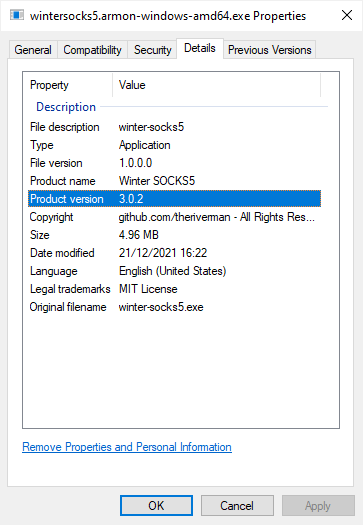

# Go CLI Project
A template repositry for creating unified CLI applications in Go.

# Introduction
This template implies the following conditions:
  * the project is version controlled using Git
  * the project uses semantic versioning
  * the project uses Git tags to create releases
  * git tags equal to the released semantic version (e.g.: 2.4.0)

All built binaries are put to the [dist](./dist) folder

## Build/Host System Requirements
  * sh/Bash (use Git Bash for Windows)
  * GNU Make (available for Windows too)
  * Go compiler utils are available in `$PATH`

# Initialise The Project
Execute the steps described in these subsections to initialise the project using this template.
## Create a `go.mod` file:
```bash
go mod init example.com/m       # to initialize a v0 or v1 module
go mod init example.com/m/v2    # to initialize a v2 module
```
## Configure the values in `Makefile`
  * Set the value of `BUILD_TYPE`. This is used to distinguish between build types (optional)
  * Set the value of `BINARY_NAME`. This is used when generating the binary output

## Configure the values in `versioninfo.json`
Update the respective values under `StringFileInfo`. Optionally update the values of `FixedFileInfo.FileVersion` too.

## Configure the values in `.github/workflows/makefile-build-release.yml`
Update the following fields in [makefile-build-release.yml](.github/workflows/makefile-build-release.yml):
  * Set up Go / go-version
  * GH Release Artefacts / files (all binary files must be listed manually)

The `GH Release Artefacts / files` array shall contain all binary outputs which has to be uploaded to the GitHub releases page.

# Project Structure
See below an explanation for the key files of a typical Go project.
```
$ tree ./go-cli-app-template
.
├── LICENSE           # license for using this template. override for your project
├── Makefile          # build targets
├── README.md         # instructions for using this template. override for your project
├── cli.app.go        # the main CLI application. extend for your project
├── cli.commands.go   # additional commands underneath the main CLI application. extend for your project
├── dist              # folder containing your binaries
│   └── MY-APP.exe    # your typical binary output(s)
├── go.mod            # should be generated using go mod init ...
├── go.sum            # should be generated using go mod init ...
├── main.go           # the entrypoint to your Go application. typically no changes needed here
└── versioninfo.json  # executable file details (Windows-only)
```

# Building the Project
The recommended approach to building the project is using [Make](https://en.wikipedia.org/wiki/Make_(software)).

Typical build targets defined in `Makefile` are the following:
  * **build**: builds the project for your system's OS/Architecture. the output file is `./dist/$(BINARY_NAME)$(BINARY_SUFFIX)`
  * **build-darwin**:   builds the project for Darwin/MacOS targeting amd64 and arm64
  * **build-linux**:    builds the project for Linux targeting 386/amd64/arm/arm64
  * **build-windows**:  builds the project for Windows targeting 386/amd64
  * **build-all**:      builds the project for all above declared targets
  * **clean**:          removes all built binaries and build artefacts

Additionally a demonstration-only target called `build-enterprise-linux` is also present in the template's Makefile to propagate the conditional compilation possibilities of Go using [Build Tags](https://www.digitalocean.com/community/tutorials/customizing-go-binaries-with-build-tags).

These targets can be fully customised depending on the needs of your project.

# A Complete CLI Application
An project (called **SOCKS5 CLI**) built using this template results in a CLI application similar to below:
```txt
./wintersocks5.armon-windows-amd64.exe --help

NAME:
   SOCKS5 CLI - SOCKS5 CLI | A tiny CLI wrapper around github.com/theriverman/go-socks5 (forked from github.com/armon/go-socks5)

USAGE:
   wintersocks5.armon-windows-amd64.exe [global options] command [command options] [arguments...]

VERSION:
   3.0.2

COMMANDS:
   server   Starts the SOCKS5 server
   version  Show the SOCKS5 CLI version information (detailed)
   help, h  Shows a list of commands or help for one command

GLOBAL OPTIONS:
   --verbose      Runs the application in verbose mode (default: false)
   --help, -h     show help (default: false)
   --version, -V  Prints version information of go-socks5-cli and quit (default: false)

COPYRIGHT:
   SOCKS5 CLI | MIT License | All Rights Reserved 2021 - 2022
```

Windows binaries will be extended with [Version Information](https://docs.microsoft.com/en-gb/windows/win32/menurc/version-information) based on the contents of [versioninfo.json](./versioninfo.json), and the state of the Git repository (last commit hash & latest tag).



# Contribution
Fork the repository, then add `go.mod` and `go.sum` to `.git/info/exclude` to avoid adding these files to the project via the template:
```bash
echo "go.mod" >> .git/info/exclude
echo "go.sum" >> .git/info/exclude
```

## Roadmap
- [x] Files for demonstrating a project layout
- [x] Windows Version Information support
  - [x] versioninfo.json
  - [x] make target: generate-win-versioninfo
  - [ ] custom icon for the binary output
- [ ] Tests
  - [ ] unit test cases
  - [ ] make target: test 
  - [ ] make target: lint
- [ ] Project initialisation script
  - [ ] remove template-specific contents from README.md
  - [ ] create go.mod and go.sum based on username/project path
  - [ ] make all steps skippable
  - [ ] verify project LICENSE file contents

# Acknowledgements
  * github.com/josephspurrier/goversioninfo
